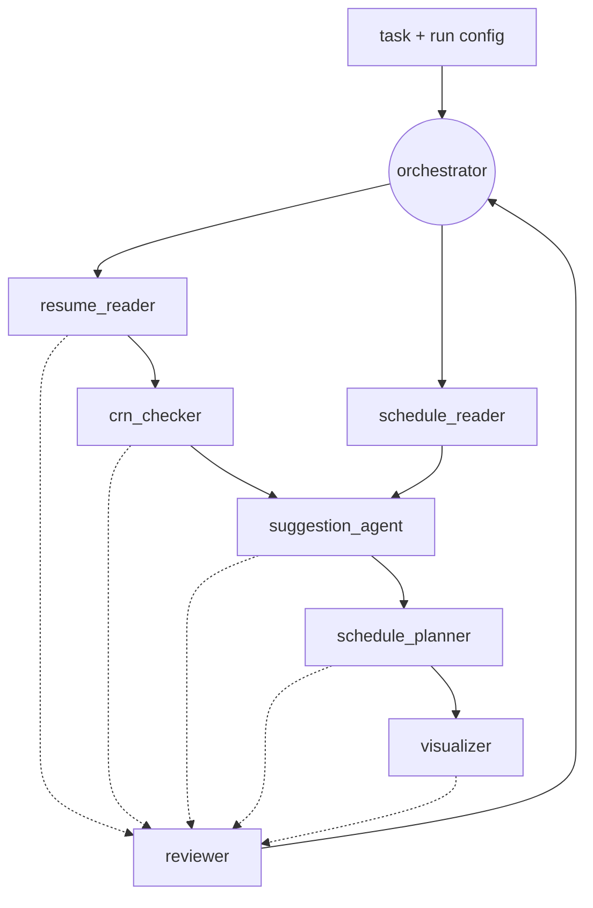

# Agent Wiring Notes

Working notes on how to connect the agents in this repo into an actual
multi-agent system. Written after an audit of `main` on 2026-07-30.

These notes cover the **applicant / scheduling pipeline** (the one described in
`requirements.txt` and implemented under `agents/`). The separate
`docs/website-factory/ARCHITECTURE.md` describes a six-node website factory;
where possible the conventions below are deliberately borrowed from it so the two
pipelines can eventually share one runtime.

---

## 1. Current state

What is on `main` today:

| Piece | Status |
| --- | --- |
| `BaseAgent` / `Message` | Defined, works, but `history` is write-only |
| `WorkerAgent` | Returns an f-string placeholder, no LLM call |
| `Orchestrator` | Builds every `agents.yaml` entry as a generic `WorkerAgent` |
| `ScheduleReaderAgent` | **Dead code** - nothing imports it |
| `agents.yaml` | Lists 4 agents; `shared_memory` / `max_message_length` unused |
| `data/applicants.csv` | `name,available_day`, 2 rows, no stable id |
| Tests | None |

Known defects to fix as part of the wiring work:

1. `Orchestrator.__init__` constructs `WorkerAgent` for every config entry, so the
   real `ScheduleReaderAgent` class is never instantiated.
2. `Orchestrator.run` fans the identical raw task string out to all agents.
   `ScheduleReaderAgent.run` expects a **file path**, so it would raise
   `FileNotFoundError` even if it were wired in.
3. The `reviewer` agent receives the original task, never other agents' output,
   so it cannot review anything.
4. `orchestrator.max_iterations` is read from config and never used.
5. `communication.shared_memory: true` is not implemented - there is no shared store.
6. No LLM is ever called. `openai`, `python-dotenv` and `tenacity` are unused
   dependencies and the `model:` field on each agent has no effect.
7. `ScheduleReaderAgent` returns `str(list_of_dicts)` - a Python repr that a
   consumer could only parse with `eval()`. Pydantic is already a dependency.
8. That same method opens the CSV with no `encoding=` and no error handling.

---

## 2. Target topology



`resume_reader` and `schedule_reader` are independent and can run in parallel.
Everything downstream is ordered by data dependency, not by list position in
`agents.yaml`.

---

## 3. Node contracts

| Agent | Type | Consumes | Emits |
| --- | --- | --- | --- |
| `resume_reader` | `agent.intake` | `data/resumes/*` | `candidate.record[]` |
| `schedule_reader` | `agent.intake` | `data/applicants.csv` | `availability.record[]` |
| `crn_checker` | `agent.validation` | `candidate.record[]` | `crn.verdict[]` |
| `suggestion_agent` | `agent.reasoning` | `crn.verdict[]` + `availability.record[]` | `suggestion[]` |
| `schedule_planner` | `agent.planning` | `suggestion[]` | `schedule.plan` |
| `visualizer` | `agent.render` | `schedule.plan` | `artifact.image[]` |
| `reviewer` | `agent.critic` | all of the above | `review.report` |

---

## 4. How to actually connect them

### 4.1 Type registry

Stop hard-coding `WorkerAgent`. Add `agents/registry.py` mapping a `type` string
from `agents.yaml` to a class, defaulting to `WorkerAgent` when unknown:

```python
AGENT_TYPES = {
    "schedule_reader": ScheduleReaderAgent,
    "resume_reader": ResumeReaderAgent,
    "crn_checker": CrnCheckerAgent,
    # ...
}

def build_agent(cfg: dict) -> BaseAgent:
    cls = AGENT_TYPES.get(cfg.get("type"), WorkerAgent)
    return cls(
        name=cfg["name"],
        role=cfg["role"],
        model=cfg.get("model", "gpt-4o-mini"),
        tools=cfg.get("tools", []),
        options=cfg.get("options", {}),
    )
```

This alone makes `ScheduleReaderAgent` live and keeps the README promise that new
agents can be added without editing orchestration code.

### 4.2 Shared blackboard

Implement `communication.shared_memory` as a `Blackboard` - a dict of structured
results keyed by agent name, passed to every `run()` call:

```python
class Blackboard(dict):
    def put(self, key, value):
        self[key] = value

    def require(self, key):
        if key not in self:
            raise KeyError(f"missing upstream output: {key}")
        return self[key]
```

Change the agent contract from `run(task: str) -> str` to
`run(task: Task, board: Blackboard) -> AgentResult`. This is the single most
important change: it is what lets the reviewer see upstream output.

### 4.3 Dependency ordering

Add `depends_on` to each entry in `agents.yaml` and topologically sort in the
orchestrator instead of iterating the list in file order. Detect cycles and fail
loudly at startup rather than at run time.

### 4.4 Typed results

Use pydantic (already a dependency) for every payload. Borrow the envelope shape
from the website-factory doc so both pipelines log the same way - at minimum
`run_id`, `node`, `status`, `payload`, `errors`. Never pass `str(obj)`
between agents.

### 4.5 One LLM client

Put a single client in `agents/llm.py`: loads `OPENAI_API_KEY` via
`python-dotenv`, wraps calls in `tenacity` retry with jittered backoff, takes the
model name from the agent's config, and truncates prompts to
`communication.max_message_length`. Every model-using agent calls through it so
retries, logging and cost caps live in one place.

### 4.6 Review loop

Wrap the reviewer in a loop bounded by `orchestrator.max_iterations`. If the
reviewer returns `status: needs_rework` with a target agent, re-run that agent
once with the critique appended, then escalate to a human rather than silently
shipping.

---

## 5. Required data changes

- Add a stable `applicant_id` column to `data/applicants.csv`. Joining resumes to
  availability on `name` will silently mismatch people as soon as there are two
  similar names.
- Create `data/resumes/` for the resume reader. **Commit synthetic fixtures only.**
  Real resumes are personal data - add the real directory to `.gitignore`.
- Treat CRN values as sensitive: never log them in full, mask to the last 4 characters.

---

## 6. Proposed agents.yaml shape

```yaml
orchestrator:
  name: orchestrator
  role: Coordinates tasks and delegates work to specialized worker agents
  model: gpt-4o-mini
  max_iterations: 10

agents:
  - name: schedule_reader
    type: schedule_reader
    role: Reads applicant availability and extracts structured schedule data
    model: gpt-4o-mini
    tools: [file_reader]
    depends_on: []
    options:
      path: data/applicants.csv
    outputs: [availability.record]

  - name: resume_reader
    type: resume_reader
    role: Parses resumes into structured candidate records
    depends_on: []
    options:
      path: data/resumes
    outputs: [candidate.record]

  - name: crn_checker
    type: crn_checker
    role: Validates the CRN on each candidate record
    depends_on: [resume_reader]
    outputs: [crn.verdict]

  - name: suggestion_agent
    type: suggestion_agent
    role: Recommends candidates using CRN verdicts and availability
    depends_on: [crn_checker, schedule_reader]
    outputs: [suggestion]

  - name: visualizer
    type: visualizer
    role: Renders schedule simulations as images
    depends_on: [schedule_planner]
    enabled: false          # expensive - opt in explicitly
    outputs: [artifact.image]

  - name: reviewer
    type: reviewer
    role: Reviews outputs from other agents for quality and correctness
    depends_on: [suggestion_agent, visualizer]
    outputs: [review.report]

communication:
  protocol: message_passing
  shared_memory: true
  max_message_length: 4000
```

---

## 7. Suggested order of work

1. Registry + blackboard + typed results (unblocks everything else).
2. Wire `ScheduleReaderAgent`, give it `options.path` and JSON output. Add a test.
3. Add `applicant_id` to the CSV.
4. `agents/llm.py` with retry, then convert `WorkerAgent` to use it.
5. `resume_reader` + `crn_checker` (regex first, LLM only for ambiguous cases -
   cheaper and far more auditable than asking a model to validate identifiers).
6. `suggestion_agent`, then `schedule_planner`.
7. `visualizer` last, behind the `enabled` flag.

---

## 8. Open questions for the team

- Is `schedule_planner` a separate agent or part of `suggestion_agent`?
- What is the authoritative source for CRN validation - a regex/checksum, a local
  registry file, or an external API? This decides whether `crn_checker` needs a
  network tool at all.
- Should the applicant pipeline and the website factory share one runtime and one
  envelope, or stay separate? `docs/website-factory/ARCHITECTURE.md` references
  `workflows/website-factory.workflow.json`, which does not exist in the repo yet.
- Which framework, if any (LangGraph, CrewAI, AutoGen), or keep the custom loop?
