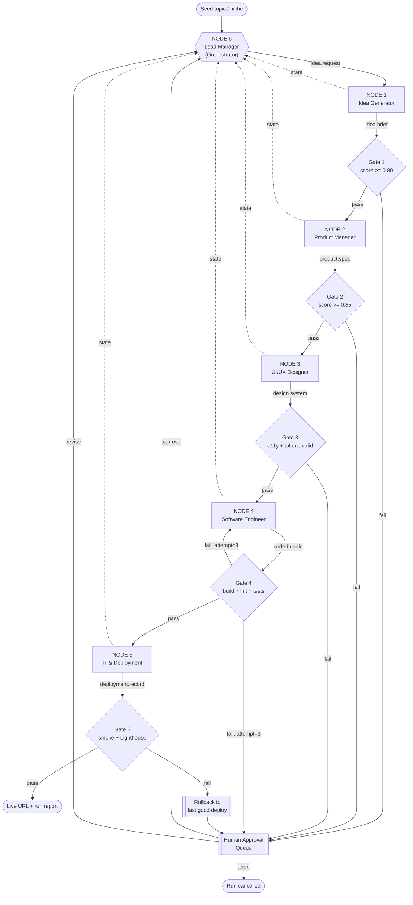

# Website Generation & Deployment Factory

**Node-Based Visual Workflow Architecture · v1.0.0**

An end-to-end, six-node agent factory that turns a seed topic into a live, deployed website.
Every agent is modelled as a standalone **Node** with a typed input contract, internal logic,
a typed output contract, and a JSON payload envelope, so the whole system can be exported to
(or rebuilt inside) an engine such as n8n, LangGraph, Temporal, Airflow, or Prefect.

---

## 1. Design principles

1. **Contracts over conversation.** Nodes never chat with each other. They exchange validated JSON envelopes. If it is not in the schema, it does not cross the wire.
2. **Every node is replaceable.** A node is a black box defined only by `input_schema`, `output_schema`, and `tools[]`. Swap the model, the prompt, or the whole implementation without touching neighbours.
3. **Envelope-first.** All payloads are wrapped in one canonical envelope (section 4) carrying identity, trace, quality, artifacts, and routing metadata.
4. **Gate, then escalate.** Each node emits a `quality.score`. Below threshold, the Orchestrator reworks once, then asks a human. It never silently ships degraded output.
5. **Idempotency by construction.** Every node accepts an `idempotency_key` = `hash(run_id + node_id + attempt_of_input)`. Re-running a node with the same key must not create a second repo, project, or deployment.
6. **Deterministic seams.** Creative work (ideation, design) is stochastic. Structural work (scaffolding, git, deploy) is templated and deterministic. The seam between them is always a schema.
7. **Replayability.** Every envelope is persisted. Any run can be resumed from any node without re-executing upstream work.

---

## 2. Topology



---

## 3. Node registry

| # | Node ID | Type | Consumes | Emits | Spec |
|---|---------|------|----------|-------|------|
| 1 | `idea_generator` | `agent.ideation` | `seed.topic` | `idea.brief` | [01-idea-generator.md](nodes/01-idea-generator.md) |
| 2 | `product_manager` | `agent.product` | `idea.brief` | `product.spec` | [02-product-manager.md](nodes/02-product-manager.md) |
| 3 | `uiux_designer` | `agent.design` | `product.spec` | `design.system` | [03-uiux-designer.md](nodes/03-uiux-designer.md) |
| 4 | `software_engineer` | `agent.engineering` | `design.system` + `product.spec` | `code.bundle` | [04-software-engineer.md](nodes/04-software-engineer.md) |
| 5 | `it_deployment` | `agent.devops` | `code.bundle` | `deployment.record` | [05-it-deployment.md](nodes/05-it-deployment.md) |
| 6 | `lead_manager` | `agent.orchestrator` | all envelopes | `run.report` | [06-lead-manager-orchestrator.md](nodes/06-lead-manager-orchestrator.md) |

Machine-readable topology: [../../workflows/website-factory.workflow.json](../../workflows/website-factory.workflow.json)

---

## 4. The canonical envelope

Every edge in the graph carries exactly this shape. `payload` is the only node-specific part.

```json
{
  "envelope_version": "1.0.0",
  "run_id": "run_20260730_a17f3c",
  "idempotency_key": "sha256:9f2c1d...",
  "node": {
    "id": "product_manager",
    "type": "agent.product",
    "version": "1.2.0",
    "model": "claude-opus-4"
  },
  "trace": {
    "parent_node": "idea_generator",
    "attempt": 1,
    "started_at": "2026-07-30T09:14:02Z",
    "finished_at": "2026-07-30T09:14:51Z",
    "duration_ms": 49118,
    "tokens": { "in": 8123, "out": 3044 },
    "cost_usd": 0.41
  },
  "status": "ok",
  "quality": {
    "score": 0.88,
    "threshold": 0.85,
    "rubric": {
      "completeness": 0.90,
      "internal_consistency": 0.92,
      "scope_discipline": 0.84,
      "testability": 0.86
    },
    "violations": []
  },
  "payload": { "...": "node-specific, see node spec" },
  "artifacts": [
    {
      "kind": "markdown",
      "path": "runs/run_20260730_a17f3c/pm/feature-specs.md",
      "sha256": "b41e...",
      "bytes": 18422
    }
  ],
  "errors": [],
  "next": { "route": "uiux_designer", "reason": "gate_passed" }
}
```

**Status vocabulary:** `ok` · `degraded` (usable, below target) · `needs_human` · `failed` · `skipped` (cache hit).

---

## 5. Run lifecycle (state machine)

```
INIT ──> IDEATION ──> PRODUCT_DEF ──> DESIGN ──> BUILD ──> DEPLOY ──> VERIFY ──> DONE
             │             │            │          │         │          │
             └─────────────┴────────────┴──────────┴─────────┴──────────┘
                                        │
                                        ▼
                              REWORK (max 2 per node)
                                        │
                                        ▼
                              HUMAN_REVIEW ──> APPROVED | REVISED | ABORTED
                                        │
                                        ▼
                              FAILED / ROLLED_BACK
```

State is persisted after every transition as an append-only event log, so `run_state` is a
projection and never the source of truth:

```json
{
  "run_id": "run_20260730_a17f3c",
  "state": "BUILD",
  "cursor": "software_engineer",
  "completed": ["idea_generator", "product_manager", "uiux_designer"],
  "attempts": { "software_engineer": 2 },
  "budget": { "usd_spent": 3.84, "usd_cap": 12.00, "wall_clock_cap_min": 45 },
  "blocking_question": null,
  "last_good_deployment": "dpl_7Hs2..."
}
```

---

## 6. Conditional routing table

| From | Condition | Route to | Notes |
|------|-----------|----------|-------|
| Gate 1 | `quality.score >= 0.80` | `product_manager` | happy path |
| Gate 1 | `score < 0.80` and `attempt < 2` | `idea_generator` | rework with critique appended |
| Gate 1 | `score < 0.80` and `attempt = 2` | `human_approval` | present top-3 variants for choice |
| Gate 2 | `scope.out_of_scope.length = 0` | `human_approval` | a spec with no explicit exclusions is a scope-creep bomb |
| Gate 2 | `score >= 0.85` | `uiux_designer` | |
| Gate 3 | `contrast_ratio < 4.5` on any text token pair | `uiux_designer` | auto-fix palette, re-run |
| Gate 3 | components referenced by PM but missing in hierarchy | `uiux_designer` | coverage check |
| Gate 4 | `build.exit_code != 0` and `attempt < 3` | `software_engineer` | error log injected as context |
| Gate 4 | `build.exit_code != 0` and `attempt = 3` | `human_approval` | attach full build log + diff |
| Gate 5 | `smoke.http_status = 200` and `lighthouse.perf >= 0.85` | `DONE` | |
| Gate 5 | deploy error class `E6xx` | `it_deployment` (rollback branch) | restore `last_good_deployment` |
| Any | `budget.usd_spent > usd_cap` | `human_approval` | hard stop, no exceptions |
| Any | `errors[].class in [E4xx]` | `human_approval` | secrets/auth never auto-remediated |

---

## 7. Quality gates

Each gate is a deterministic validator plus an LLM-as-critic rubric. The deterministic half
runs first and short-circuits: no point asking a critic to grade JSON that does not parse.

| Gate | Deterministic checks | Critic rubric (weighted) | Threshold |
|------|----------------------|--------------------------|-----------|
| G1 Idea | schema valid; >= 2 personas; >= 3 USPs; no duplicate USPs | novelty 0.3, market plausibility 0.3, specificity 0.4 | 0.80 |
| G2 Product | schema valid; every story has acceptance criteria; `out_of_scope` non-empty; roadmap phases ordered | completeness 0.3, consistency 0.3, scope discipline 0.2, testability 0.2 | 0.85 |
| G3 Design | WCAG AA contrast on all text pairs; token refs resolve; every PM feature maps to >= 1 component | hierarchy clarity 0.4, token coherence 0.3, layout semantics 0.3 | 0.85 |
| G4 Code | `install`, `lint`, `typecheck`, `test`, `build` all exit 0; no secrets in diff (gitleaks); bundle < budget | modularity 0.3, readability 0.2, spec coverage 0.3, a11y markup 0.2 | 0.85 |
| G5 Deploy | HTTP 200 on all routes; TLS valid; Lighthouse perf/a11y/SEO; no 4xx in first 50 requests | n/a (objective only) | perf >= 0.85 |

---

## 8. Human-in-the-loop protocol

The Orchestrator is the **only** node permitted to talk to a human. When a gate fails
terminally it emits an approval request and blocks that branch:

```json
{
  "type": "approval.request",
  "run_id": "run_20260730_a17f3c",
  "blocking_node": "software_engineer",
  "reason": "gate_failed",
  "error_class": "E5xx",
  "summary": "Build fails on 3rd attempt: unresolved import in PricingTable.tsx",
  "options": [
    { "id": "retry_with_hint", "label": "Retry with a corrective hint", "requires_input": true },
    { "id": "downgrade_stack", "label": "Fall back to static HTML/CSS/JS template" },
    { "id": "drop_feature", "label": "Drop the failing feature and continue" },
    { "id": "abort", "label": "Abort run and keep artifacts" }
  ],
  "artifacts": ["runs/.../build.log", "runs/.../diff.patch"],
  "sla_minutes": 120,
  "on_timeout": "park_run"
}
```

Rules: human decisions are recorded as first-class events; `on_timeout` is never
`auto_approve` for anything touching credentials, spend, production DNS, or public
visibility. Approval is requested, not assumed.

---

## 9. Error taxonomy and retry matrix

The IT & Deployment Node doubles as the system SRE: it owns this table and is the handler of
last resort for every node failure.

| Class | Meaning | Typical cause | Automatic remedy | Escalate after |
|-------|---------|---------------|------------------|----------------|
| E1xx | Contract violation | output fails `output_schema` | re-prompt with validator errors injected | 2 attempts |
| E2xx | Quality gate failure | score below threshold | rework with critique | 2 attempts |
| E3xx | Tool / integration error | API 5xx, timeout, network | exponential backoff 2^n + jitter, cap 3 | 3 attempts |
| E4xx | Auth / secrets | expired token, missing scope | **none** — halt and ask human | immediately |
| E5xx | Build / compile | bad import, type error, dep conflict | feed log to engineer node, pin deps, clear cache | 3 attempts |
| E6xx | Deploy / infra | provider outage, bad config, DNS | retry, then rollback to `last_good_deployment` | 2 attempts |
| E7xx | Budget / rate limit | token cap, spend cap, 429 | queue with backoff; hard stop on spend cap | on cap breach |
| E8xx | Human timeout | no decision within SLA | park run, notify, preserve artifacts | n/a |

Backoff: `delay = min(60s, 2^attempt * 1s) * (1 + rand(0, 0.3))`. Every retry carries the
same `idempotency_key` so no duplicate repos or deployments are ever created.

---

## 10. Observability

- **Event log** — append-only JSONL per run: `runs/<run_id>/events.jsonl`.
- **Artifact store** — every markdown spec, token file, diff, build log, and Lighthouse report, content-addressed by sha256.
- **Metrics** — per node: p50/p95 latency, cost, gate pass rate, rework rate, escalation rate.
- **Run report** — final `run.report` envelope: live URL, repo URL, commit SHA, total cost, gates passed, human interventions, and every decision that was made on the way.

---

## 11. Generated site repository layout

The Software Engineer Node emits this structure; the IT Node commits and deploys it.

```
<generated-site>/
├── README.md
├── .env.example              # keys by name only, never values
├── .github/workflows/ci.yml  # lint, typecheck, test, build
├── package.json
├── next.config.mjs
├── src/
│   ├── app/                  # routes
│   ├── components/           # one folder per design-system component
│   ├── styles/tokens.css     # generated from design.system tokens
│   └── lib/
├── public/
├── tests/
└── docs/
    ├── product-spec.md       # from Node 2
    └── design-system.md      # from Node 3
```

---

## 12. Extending the factory

Add a node in four steps: define its `input_schema` and `output_schema`; register it in
`workflows/website-factory.workflow.json`; add a gate with a deterministic validator and a
critic rubric; declare its error classes so the IT Node knows how to recover it. Candidate
next nodes: `seo_content` (Node 3.5), `qa_automation` (Node 4.5, Playwright),
`analytics_instrumentation`, `legal_compliance` (cookie banner, privacy policy).
